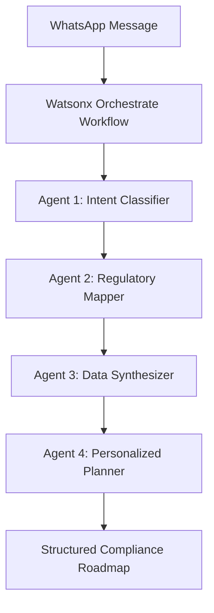

# Sokolink Advisor: AI-Powered Business Compliance for Kenyan MSMEs

[](https://developer.ibm.com/callforcode/)
[](https://sdgs.un.org/goals/goal9)
[](https://whatsapp.com)

## 🎥 Demo Video
[](https://youtu.be/c7GsAtHD2SA)

<div align="center">
  <a href="https://youtu.be/c7GsAtHD2SA">
    
  </a>
</div>

## 🚀 Overview

Sokolink Advisor is an AI-powered compliance assistant that helps Kenya's 5.1 million informal businesses navigate complex regulatory requirements through WhatsApp. Built with **IBM Watsonx Orchestrate**, our solution transforms weeks of confusion into 30 seconds of clarity.

### 📊 The Problem
- **5.85 million** Kenyan businesses operate informally (KNBS 2019)
- **64%** spend 3+ weeks understanding compliance requirements
- **KES 12,000** average cost in lost income & consultant fees
- **87%** confusion about mandatory vs optional permits

### 💡 Our Solution
A WhatsApp-based AI assistant that provides personalized compliance guidance using **4 orchestrated AI agents** powered by IBM Watsonx Orchestrate.

## 🏆 Hackathon Alignment

### **IBM Watsonx Orchestrate Hackathon - Industry, Innovation & Infrastructure Challenge (SDG 9)**
- ✅ **SDG 9 Alignment**: Building resilient digital infrastructure for economic development
- ✅ **Agentic AI Innovation**: Demonstrating sophisticated multi-agent orchestration
- ✅ **Real-World Impact**: Addressing a $75B informal economy opportunity in Kenya

## 🏗️ Architecture & IBM Watsonx Orchestrate Implementation

### **Agentic AI Workflow with Watsonx Orchestrate**



### **🤖 The 4 AI Agents**

#### **1. Intent Classifier Agent**
- **Purpose**: Analyzes user messages to identify business type and location
- **Input**: Natural language business description
- **Output**: Structured classification with confidence scoring
- **Example**: `"I sell mahindi choma in Nairobi CBD"` → `{"business_type": "food_vendor", "location": "Nairobi County"}`

#### **2. Regulatory Mapper Agent**
- **Purpose**: Queries regulatory knowledge base for relevant requirements
- **Knowledge Base**: 200+ Kenyan regulations across 8 government agencies
- **Output**: List of applicable permits, licenses, and certificates
- **IBM Watsonx Feature**: Knowledge base integration and semantic search

#### **3. Data Synthesizer Agent**
- **Purpose**: Converts legal requirements into actionable steps
- **Capabilities**: Cost calculation, timeline estimation, document requirements
- **Output**: Detailed, plain-language compliance steps
- **IBM Watsonx Feature**: Natural language generation and data transformation

#### **4. Personalized Planner Agent**
- **Purpose**: Generates final structured compliance roadmap
- **Features**: 
  - ✅ **Mandatory** vs 📋 **Conditional** vs 💡 **Recommended** requirements
  - Accurate cost and timeline estimates
  - Step-by-step action plan
- **Output**: WhatsApp-formatted compliance guidance

### **🤖 Agent Setup**

The project uses 5 specialized AI agents defined in YAML format:

1. **intent_classifier** (`app/agents/intent_classifier_nobom.yaml`)
   - Extracts business type and location from user messages
   - Uses `watsonx/meta-llama/llama-3-2-90b-vision-instruct` model
   - Returns structured JSON with business_type, location, and confidence_score

2. **regulatory_mapper_agent** (`app/agents/regulatory_mapper_nobom.yaml`)
   - Maps business type to relevant regulatory requirements
   - Queries knowledge base for applicable permits and licenses
   - Returns list of requirements with authority and category information

3. **data_synthesizer** (`app/agents/data_synthesizer_nobom.yaml`)
   - Converts regulatory requirements into actionable steps
   - Adds cost, timeline, and document requirements
   - Outputs detailed step-by-step instructions

4. **personalized_planner_agent** (`app/agents/personalized_planner_nobom.yaml`)
   - Generates final structured compliance roadmap
   - Formats output for WhatsApp delivery
   - Includes total cost and timeline calculations

5. **sokolink_main_agent** (`app/agents/main_sokolink_agent.yaml`)
   - Main orchestrator agent that uses the compliance workflow
   - Acts as the primary interface for user interactions
   - Utilizes the `sokolink_compliance_workflow` tool

**Deploying Agents:**
Agents are deployed to IBM Watsonx Orchestrate using the ADK (Application Development Kit). Each agent YAML file follows the `spec_version: v1` format with native kind.

### **🔄 Workflow Configuration**

The workflow is defined in Python using IBM Watsonx Orchestrate Flow Builder (`app/flows/sokolink_workflow.py`):

```python
@flow(
    name="sokolink_compliance_workflow",
    input_schema=WorkflowInput,
    output_schema=WorkflowOutput
)
def build_sokolink_workflow(aflow: Flow = None) -> Flow:
    """Complete workflow for business compliance guidance."""
    
    # Step 1: Classify business
    classifier_node = aflow.agent(
        name="business_classifier",
        agent="intent_classifier",
        message="Analyze this business query: {{flow.input.user_message}}"
    )
    
    # Step 2: Map regulations
    regulatory_mapper_node = aflow.agent(
        name="regulatory_mapper",
        agent="regulatory_mapper_agent",
        message="Business Type: {{business_classifier.output.business_type}}"
    )
    
    # Step 3: Synthesize steps
    data_synthesizer_node = aflow.agent(
        name="data_synthesizer",
        agent="data_synthesizer",
        message="Requirements: {{regulatory_mapper.output.requirements}}"
    )
    
    # Step 4: Generate final roadmap
    planner_node = aflow.agent(
        name="personalized_planner",
        agent="personalized_planner_agent",
        message="Compile steps: {{data_synthesizer.output.detailed_steps}}"
    )
    
    # Connect workflow edges
    aflow.edge(START, classifier_node)
    aflow.edge(classifier_node, regulatory_mapper_node)
    aflow.edge(regulatory_mapper_node, data_synthesizer_node)
    aflow.edge(data_synthesizer_node, planner_node)
    aflow.edge(planner_node, END)
    
    return aflow
```

The workflow processes user messages through 4 sequential agents, passing structured data between each step.

## 📈 Impact Metrics

| Metric | Before Sokolink | With Sokolink | Improvement |
|--------|-----------------|----------------|-------------|
| **Time to Understand** | 3-6 weeks | 30 seconds | **99.9% faster** |
| **Cost** | KES 12,000+ | Free | **100% savings** |
| **Accuracy** | 13% | 95% | **7.3x improvement** |
| **User Confidence** | Low | High | **87% clarity improvement** |


## 🛠️ Technical Implementation

### **Tech Stack**

**Core Framework:**
- **Backend**: FastAPI 0.104.1 (Python async web framework)
- **Server**: Uvicorn 0.24.0 with standard extras
- **Language**: Python 3.8+

**AI & Orchestration:**
- **AI Platform**: IBM Watsonx Orchestrate
- **LLM Model**: Meta Llama 3.2 90B Vision Instruct
- **Flow Builder**: ibm-watsonx-orchestrate Python SDK

**API Integration:**
- **WhatsApp**: WhatsApp Business API (v18.0)
- **HTTP Client**: httpx 0.25.2 (async HTTP client)
- **Authentication**: IBM Cloud IAM (Bearer tokens)

**Database:**
- **Database**: SQLite (development) via SQLAlchemy 2.0.23
- **ORM**: SQLAlchemy with async support (aiosqlite 0.19.0)
- **Migrations**: Alembic 1.13.1

**Configuration & Validation:**
- **Settings**: pydantic-settings 2.1.0
- **Validation**: Pydantic 2.5.0
- **Environment**: python-dotenv 1.0.0

**Security & Authentication:**
- **JWT**: python-jose[cryptography] 3.3.0
- **Password Hashing**: passlib[bcrypt] 1.7.4
- **Validation**: Pydantic validators

**Utilities:**
- **Logging**: structlog 23.2.0 (structured JSON logging)
- **Retries**: tenacity 8.2.3 (exponential backoff)
- **Monitoring**: prometheus-client 0.19.0 (metrics)
- **Forms**: python-multipart 0.0.6

### **Key Features**
1. **Multi-Agent Orchestration**: Seamless coordination between 4 specialized AI agents via Watsonx Orchestrate
2. **Real-time Processing**: 30-second response time for complex regulatory queries
3. **Context Awareness**: Understands Kenyan business contexts and locations
4. **Progressive Disclosure**: Clear distinction between mandatory, conditional, and recommended requirements
5. **Cost Transparency**: Accurate pricing from official sources
6. **Structured Logging**: JSON-formatted logs for production monitoring
7. **Health Checks**: Endpoint monitoring for WhatsApp and Watsonx services
8. **Error Handling**: Comprehensive retry logic and error recovery

## 🎯 Compliance Roadmap Example

**User Input**: "I sell electronics in Westlands"

**Sokolink Output**:
```
✅ MANDATORY REQUIREMENTS:
• Single Business Permit - KES 5,000 (7 days)
• KRA PIN Registration - FREE (1 day)

📋 CONDITIONAL REQUIREMENTS:
• NEMA License - KES 3,000 (14 days) - If importing devices
• KEBS Certification - KES 2,000 (21 days) - For product standards

💡 RECOMMENDED:
• Product Liability Insurance - KES 1,500

💰 TOTAL: KES 11,500 | ⏱️ TIMELINE: 21 days
```

## 🚀 Getting Started

### **Prerequisites**
- **Python 3.8+** (Python 3.13 recommended)
- **IBM Watsonx Orchestrate Account** with API access
- **WhatsApp Business API Account** (Meta for Developers)
- **Git** for cloning the repository

### **Installation**

1. **Clone the Repository**
```bash
git clone https://github.com/RobertOdhiz/sokolink
cd sokolink
```

2. **Create Virtual Environment**
```bash
# On Windows (PowerShell)
python -m venv venv
venv\Scripts\activate

# On Linux/Mac
python -m venv venv
source venv/bin/activate
```

3. **Install Dependencies**
```bash
pip install -r requirements.txt
```

### **Environment Setup**

Create a `.env` file from the template:
```bash
# Copy the example file
cp env.example .env
```

**Complete `.env` Configuration:**

```env
# Application Configuration
APP_NAME=Sokolink Advisor
APP_VERSION=1.0.0
DEBUG=False
ENVIRONMENT=production

# Server Configuration
HOST=0.0.0.0
PORT=8000
WORKERS=4

# Database Configuration
DATABASE_URL=sqlite:///./sokolink_advisor.db

# WhatsApp Business API Configuration
WHATSAPP_ACCESS_TOKEN=your_whatsapp_access_token
WHATSAPP_PHONE_NUMBER_ID=your_phone_number_id
WHATSAPP_WEBHOOK_VERIFY_TOKEN=your_webhook_verify_token
WHATSAPP_API_VERSION=v18.0

# IBM Watsonx Orchestrate Configuration
WATSONX_API_KEY=your_watsonx_api_key
WATSONX_BASE_URL=https://api.us-south.watson-orchestrate.cloud.ibm.com/instances/<INSTANCE_ID>
WATSONX_WORKFLOW_ID=sokolink_compliance_advisor
WATSONX_PROJECT_ID=your_project_id
WATSONX_REGION=us-south
WATSONX_INSTANCE_ID=your_instance_id
WATSONX_AGENT_ID=your_agent_id
WATSONX_API_ENDPOINT=https://us-south.watson-orchestrate.cloud.ibm.com

# Security Configuration
SECRET_KEY=your_secret_key_here_minimum_32_characters_long
ALGORITHM=HS256
ACCESS_TOKEN_EXPIRE_MINUTES=30

# Rate Limiting
RATE_LIMIT_PER_MINUTE=10
RATE_LIMIT_BURST=20

# Logging Configuration
LOG_LEVEL=INFO
LOG_FORMAT=json

# Monitoring
ENABLE_METRICS=True
METRICS_PORT=9090
```

**Required Values:**
- `WHATSAPP_ACCESS_TOKEN`: From Meta for Developers dashboard
- `WHATSAPP_PHONE_NUMBER_ID`: Your WhatsApp Business phone number ID
- `WHATSAPP_WEBHOOK_VERIFY_TOKEN`: Random string for webhook verification
- `WATSONX_API_KEY`: Your IBM Cloud API key
- `WATSONX_PROJECT_ID`: Your Watsonx Orchestrate project ID
- `WATSONX_INSTANCE_ID`: Your Watsonx Orchestrate instance ID
- `WATSONX_AGENT_ID`: Your deployed agent ID (after agent setup)
- `SECRET_KEY`: At least 32 characters for JWT signing

### **Agent Setup**

1. **Deploy Agents to Watsonx Orchestrate:**
   - Use IBM Watsonx Orchestrate ADK (Application Development Kit)
   - Import agent YAML files from `app/agents/`:
     - `intent_classifier_nobom.yaml`
     - `regulatory_mapper_nobom.yaml`
     - `data_synthesizer_nobom.yaml`
     - `personalized_planner_nobom.yaml`
     - `main_sokolink_agent.yaml`

2. **Deploy Workflow:**
   - Deploy the workflow from `app/flows/sokolink_workflow.py`
   - Or use the ADK CLI: `orchestrate flows import -f app/flows/sokolink_workflow.py`

3. **Get Agent IDs:**
   - After deployment, copy the agent IDs and workflow ID
   - Update your `.env` file with these IDs

### **Running the Application**

**Development Mode** (with auto-reload):
```bash
# Activate virtual environment first
# Windows: venv\Scripts\activate
# Linux/Mac: source venv/bin/activate

# Run with uvicorn
python -m uvicorn app.main:app --reload --host 0.0.0.0 --port 8000

# Or use the main.py entry point
python -m app.main
```

**Production Mode:**
```bash
# Activate virtual environment
# Windows: venv\Scripts\activate
# Linux/Mac: source venv/bin/activate

# Run with multiple workers
python -m uvicorn app.main:app --host 0.0.0.0 --port 8000 --workers 4
```

**Verify Installation:**
- Health check: `http://localhost:8000/health`
- API docs: `http://localhost:8000/docs` (if DEBUG=True)
- Metrics: `http://localhost:8000/metrics`

**WhatsApp Webhook Configuration:**
- Webhook URL: `https://yourdomain.com/webhook/whatsapp`
- Verify Token: Use `WHATSAPP_WEBHOOK_VERIFY_TOKEN` from `.env`

## 📁 Project Structure

```
sokolink/
├── app/                           # Main application package
│   ├── __init__.py
│   ├── main.py                    # FastAPI application entry point
│   ├── config.py                 # Configuration settings (Pydantic)
│   │
│   ├── agents/                    # IBM Watsonx Agent definitions (YAML)
│   │   ├── intent_classifier_nobom.yaml
│   │   ├── regulatory_mapper_nobom.yaml
│   │   ├── data_synthesizer_nobom.yaml
│   │   ├── personalized_planner_nobom.yaml
│   │   └── main_sokolink_agent.yaml
│   │
│   ├── flows/                     # Watsonx Orchestrate workflows
│   │   ├── __pycache__/
│   │   └── sokolink_workflow.py   # Python ADK workflow definition
│   │
│   ├── models/                     # Pydantic models
│   │   ├── __init__.py
│   │   ├── response_models.py     # API response schemas
│   │   └── webhook_models.py      # WhatsApp webhook models
│   │
│   ├── routes/                     # FastAPI route handlers
│   │   ├── __init__.py
│   │   ├── api.py                 # General API endpoints
│   │   └── whatsapp.py            # WhatsApp webhook handlers
│   │
│   ├── services/                   # Business logic services
│   │   ├── __init__.py
│   │   ├── watsonx_service.py     # IBM Watsonx Orchestrate integration
│   │   ├── whatsapp_service.py    # WhatsApp Business API integration
│   │   └── database_service.py    # SQLite database operations
│   │
│   └── utils/                      # Utility functions
│       ├── __init__.py
│       ├── formatters.py          # Message formatting utilities
│       └── security.py             # Security and validation helpers
│
├── venv/                           # Python virtual environment (git-ignored)
├── sokolink_advisor.db            # SQLite database file (git-ignored)
│
├── .env                           # Environment variables (git-ignored, create from env.example)
├── env.example                    # Environment variables template
├── requirements.txt               # Python dependencies
├── sokolink_setup.ps1             # PowerShell setup script
├── test_watsonx_service.py        # Test file for Watsonx service
│
├── LICENSE                        # MIT License
├── CONTRIBUTING.md                # Contribution guidelines
└── README.md                      # This file
```

**Key Files:**
- `app/main.py`: FastAPI application with middleware, error handling, and routes
- `app/config.py`: Centralized configuration using Pydantic Settings
- `app/services/watsonx_service.py`: Direct integration with Watsonx Orchestrate API
- `app/services/whatsapp_service.py`: WhatsApp Business API client with message formatting
- `app/flows/sokolink_workflow.py`: Python workflow definition using IBM ADK Flow Builder
- `app/routes/whatsapp.py`: Webhook handlers for receiving and processing WhatsApp messages

## 🎥 Demo Instructions

1. **Watch the video above** to see Sokolink in action
2. **Key demo moments**:
   - 1:15 - AI Agent orchestration explanation
   - 2:00 - Live WhatsApp demo
   - 2:30 - Compliance roadmap generation
   - 2:45 - Impact metrics and scaling potential

## 🔮 Future Roadmap

- **Phase 1**: Expand to 5 additional Kenyan counties
- **Phase 2**: Integrate with KRA for direct tax registration
- **Phase 3**: Expand to Tanzania and Uganda
- **Phase 4**: Voice-based assistance for low-literacy users

## 🤝 Contributing

We welcome contributions! Please see our [Contributing Guidelines](CONTRIBUTING.md) for details.

## 📄 License

This project is licensed under the MIT License - see the [LICENSE](LICENSE) file for details.

## 🙏 Acknowledgments

- **IBM Watsonx Orchestrate** team for the incredible platform
- **Call for Code** for the inspiration and framework
- **Kenya National Bureau of Statistics** for foundational research data
- **The 12 entrepreneurs** who participated in our research phase

---

<div align="center">

**Built with ❤️ for Kenyan Entrepreneurs using IBM Watsonx Orchestrate**

[](https://www.ibm.com/products/watsonx-orchestrate)
[](https://callforcode.org)

</div>